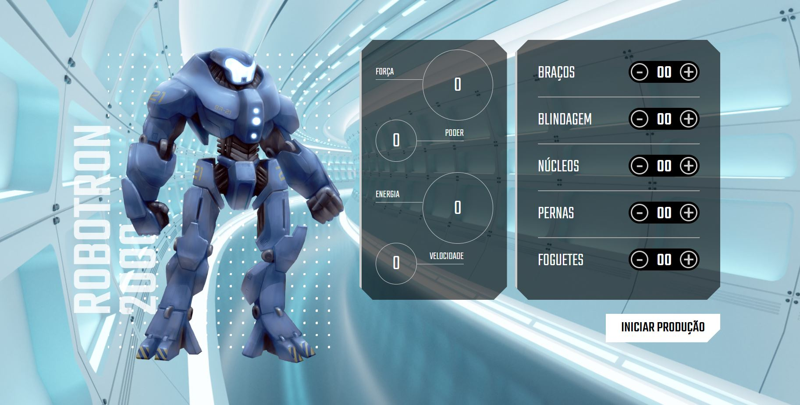

# Robotron Feature Game:

JavaScript design of a robots feature where users can build their own robots by adding features such as legs, arms, armor and rockets. Each trait added affects the robot's stats, which include strength, power, energy, and speed.

Below is a general summary of the project:

Definition of characteristics: The feature allows the user to choose between different characteristics for the robot. The available features are legs, arms, armor, cores and rockets. Each trait will have a different impact on the robot's stats.

Robot Stats: The robot stats are strength, power, energy and speed. Each of these stats is affected by the chosen characteristics. For example, adding stronger legs will increase the strength stat, while adding a more advanced core will increase the energy stat.

Choice of features: The user is free to choose which features he wants to add to his robot. Depending on player preferences and game strategy, different combinations of traits can be selected to optimize certain stats.

Impact of traits on stats: Each trait has a specific impact on the robot's stats. For example, adding stronger legs will increase the robot's strength, which can improve its ability to lift heavy objects or push obstacles. Likewise, adding stronger armor will increase the robot's ability to resist damage and improve its power stat.

Robot construction strategy: The purpose of the feature is to allow the user to develop the best robot construction strategy, choosing the characteristics that provide the greatest benefit for their playstyle. The player can try to maximize a specific stat, such as strength or speed, or seek a balance between all stats.

This is an overview of your JavaScript project, where users can build custom robots, choosing characteristics that affect the robot's statistics. Based on the choices made by the user, the robot will have different abilities and strengths. Players can experiment with different combinations of traits to create unique robots optimized for their game strategies.

# Techniques worked

Creation of an interactive page: A web page was created to allow user interaction with the robot game. This page likely contains HTML elements such as buttons, input fields, and statistics display.

Search and interaction with elements: JavaScript was used to search and interact with page elements. This can be done through manipulation of the Document Object Model (DOM), which allows you to access and manipulate HTML elements using methods and properties.

Click event handling: A click event was used to allow the user to perform actions, such as adding features to the robot. A function has been associated with this click event to run code when the user clicks a specific button or element on the page.

Functions to update gears and statistics: Two different functions were created to update the gears (characteristics) and statistics of the robot. These functions likely manipulate the values ​​of characteristics and statistics based on user choices.

Use of data attributes: Data attributes, such as data-attributes, were used to make the code more robust and independent of the interface structure. These attributes were probably used to store information related to each element, such as the type of characteristic or the affected statistic.

These techniques allow the user to interact with the page, choosing features to build his robot. The JavaScript code fetches and manipulates the elements on the page, as well as updating the robot's statistics based on the choices made. Using data attributes helps keep the code flexible, making it less dependent on the specific structure of the interface.

# How to use:

1º Option:
Access the website below:

https://xxxxx

2º Option:
Download the code and run it in your favorite code editor.

# Expansion:

With this code base, you will be able to further expand the functionalities of this web system, as you will always have functionalities to add and refine errors, test, creating your own functionalities according to your needs.

